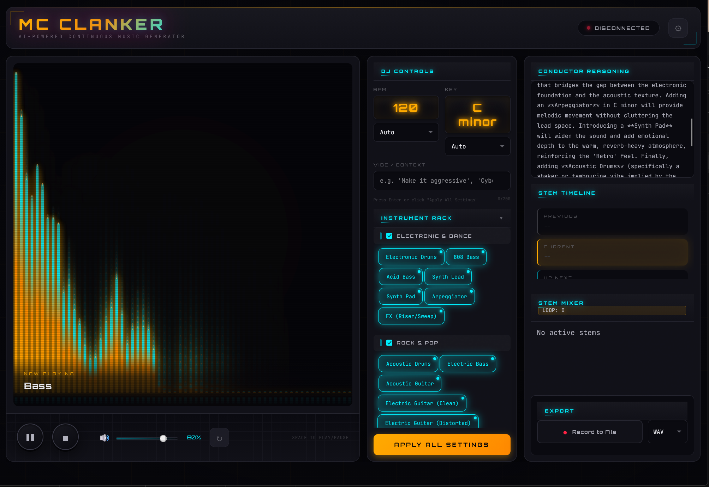
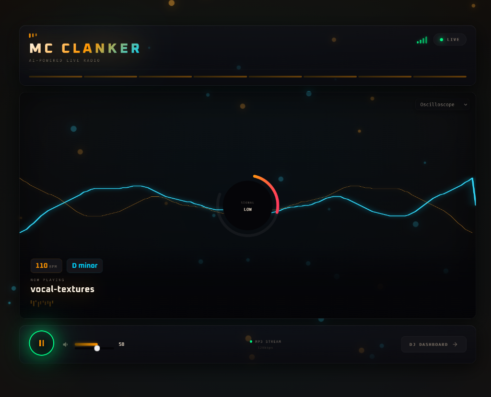

# mc-clanker

AI-Powered Continuous Music Generator — A professional DJ-style interface for real-time music generation using [Foundation-1](https://huggingface.co/RoyalCities/Foundation-1).

**mc-clanker** transforms text-to-sample models into a continuous DJ experience. Instead of generating individual samples, it creates seamless, infinitely-running music tracks controlled by an AI "Conductor" that makes DJ-style arrangement decisions.

### The DJ Interface

A professional, real-time control center where you can steer the AI Conductor, adjust stems, and manage the live mix:


### The Audience Interface

A sleek, immersive visualizer that your listeners see while tuning into the live stream:


## Features

- **Professional DJ Interface**: Dark-themed UI with audio visualizer, transport controls, and real-time feedback
- **AI Conductor**: LLM-driven track selection and arrangement
- **Stem Mixer**: Real-time control over individual stem volumes, muting, soloing, and individual stem downloads
- **Loop Counter**: Persistent tracking of generation cycles
- **Generation Config**: Adjustable `CFG Scale` and `Steps` to fine-tune the audio model performance
- **Instrument Rack**: Categorized instrument selection with custom additions
- **BPM/Key Control**: Override AI decisions with manual BPM and musical key settings
- **Vibe Context**: Natural language prompts to guide the music mood
- **File Export**: Record live sessions to WAV or MP3
- **Web Streaming**: Built-in HTTP streaming server
- **Icecast Support**: Optional streaming to Shoutcast/Icecast for web radio

## Supported Models

mc-clanker supports generation using the following text-to-audio models:

- **[Foundation-1](https://huggingface.co/RoyalCities/Foundation-1)** (Default)
- **[RC_Infinite_Pianos](https://huggingface.co/RoyalCities/RC_Infinite_Pianos)**
- **[Vocal_Textures_Main](https://huggingface.co/RoyalCities/Vocal_Textures_Main)**

## Requirements

- **GPU**: NVIDIA GPU with CUDA support (16GB VRAM minimum, 24GB+ recommended)
- **Python**: 3.10+
- **LLM Backend**: Local LLM server (e.g., Ollama, vLLM) with OpenAI-compatible API. (Must support `json_schema` format in requests. A 4096 context length is recommended).
- **Dependencies**: See `pyproject.toml` — install the web app with `uv sync` (or `uv sync --group dev` for tests); GPU worker with `uv sync --group worker`

## Setup

### Docker

```bash
# Build and run from repo root
docker compose -f docker/compose.yaml up -d

# Access interfaces
Audience UI: http://localhost:4400/listen
DJ UI:      http://localhost:4400/dj
Audio Stream: http://localhost:4400/stream.mp3
```

### LLM Setup

mc-clanker requires a local LLM backend with an OpenAI-compatible API that supports strict structured outputs via `json_schema` in requests. We highly recommend using **Qwen3.5 9b** combined with a **4096 context length**. Additionally, using a `q6` quant of this model will get the entire application (LLM + Audio Generator) gracefully running in less than 23GB of VRAM!

Configure the LLM endpoint in the DJ UI Settings modal or via environment variables:

```bash
export LLM_BASE_URL=http://localhost:1234/v1
export LLM_API_KEY=not-needed
export LLM_MODEL=local-model
```

## Usage

### DJ Interface (`/dj`)

1. Open `http://localhost:4400/dj` in your browser
2. Click **Play** or press `Space` to start the engine
3. Use **Instrument Rack** to select which sounds should be generated
4. Adjust **BPM** and **Key** overrides to control the music
5. Enter a **Vibe/Context** prompt to guide the AI (e.g., "cyberpunk night drive")
6. Watch the **Conductor Reasoning** panel to see AI decisions
7. Click **Record to File** to capture your session

### Audience Interface (`/listen`)

The audience-facing web UI at `http://localhost:4400/listen` provides real-time audio streaming and visualization.

### API Endpoints

| Endpoint | Method | Description |
| ---------- | -------- | ------------- |
| `/api/state` | GET | Get current state (BPM, key, stems, loops, etc.) |
| `/api/state` | POST | Update state (start/stop, overrides) |
| `/api/stems` | GET | Get list of active stems and their mixer states |
| `/api/stems/{idx}/volume` | POST | Set volume for a specific stem |
| `/api/stems/{idx}/mute` | POST | Toggle mute for a specific stem |
| `/api/stems/{idx}/solo` | POST | Toggle solo for a specific stem |
| `/api/stems/{idx}/download` | GET | Download a single stem as WAV |
| `/api/generation-config` | GET/POST | Get/set CFG Scale and Steps |
| `/api/instruments` | GET | Get instrument categories |
| `/api/instruments/custom` | GET/POST | Get/add custom instruments with major families |
| `/api/constants` | GET | Get schema-relevant UI constants (BPMs, Keys, Families) |
| `/api/llm-config` | GET/POST | Get/set LLM configuration |
| `/api/export/start` | POST | Start recording session |
| `/api/export/stop` | POST | Stop recording and save file |
| `/stream.mp3` | GET | Audio stream endpoint |

### Example API Usage

```bash
# Start generation
curl -X POST http://localhost:4400/api/state \
  -H "Content-Type: application/json" \
  -d '{"is_generating": true}'

# Set BPM override
curl -X POST http://localhost:4400/api/state \
  -H "Content-Type: application/json" \
  -d '{"target_bpm_override": 128}'

# Start recording
curl -X POST http://localhost:4400/api/export/start \
  -H "Content-Type: application/json" \
  -d '{"format": "mp3"}'
```

## Configuration Reference

### Environment Variables

| Variable | Default | Description |
| ---------- | --------- | ------------- |
| `LLM_BASE_URL` | `http://localhost:1234/v1` | LLM API base URL |
| `LLM_API_KEY` | `not-needed` | LLM API key |
| `LLM_MODEL` | `local-model` | LLM model name |
| `ICECAST_ENABLED` | `false` | Enable Icecast streaming |
| `EXPORT_DIR` | `/exports` | Directory for recorded files |

### Icecast Streaming (Optional)

Icecast streaming is configured via environment variables (`ICECAST_ENABLED`, `ICECAST_HOST`, `ICECAST_PORT`, `ICECAST_PASSWORD`). See `docker/compose.yaml` for the current Icecast configuration if enabled.

## Troubleshooting

### GPU Not Detected

```bash
# Verify NVIDIA GPU visibility
nvidia-smi

# Check CUDA in container
podman exec <container> nvidia-smi
```

### Audio Not Playing

- Check if `devices: nvidia.com/gpu=all` is configured in docker/compose.yaml
- Verify `/dev/snd` permissions
- On WSL2, audio may require additional configuration

### Model Loading Fails

- Ensure sufficient GPU VRAM (8GB minimum)
- Check model path and HuggingFace cache
- Review logs for specific error messages

### LLM Connection Issues

- Verify LLM server is running
- Check network connectivity to LLM_BASE_URL
- Confirm API compatibility (OpenAI-compatible)

## Architecture

| Component | Description |
| ----------- | ------------- |
| `app/app_ui.py` | FastAPI server with DJ web interface |
| `app/routes/__init__.py` | API router aggregating all route modules |
| `app/routes/shows.py` | Show management, recording, playback |
| `app/routes/jobs.py` | Job submission and status |
| `app/routes/stems.py` | Stem volume/mute/solo control |
| `app/routes/config.py` | LLM config, generation params, instruments |
| `app/routes/models.py` | Model loading/unloading |
| `app/routes/auth.py` | JWT authentication endpoints |
| `app/routes/schemas.py` | Pydantic request/response schemas |
| `app/routes/utils.py` | Route utilities (require_show_owner, etc.) |
| `app/framework/framework_main_async.py` | Async generation loop and audio mixing |
| `app/framework/framework_conductor_async.py` | LLM-powered track arrangement logic |
| `app/framework/framework_generator.py` | Audio model generation and management |
| `app/framework/framework_mixer.py` | Multi-track audio mixing engine with Stem support |
| `app/framework/framework_state.py` | Shared global state and process management |
| `app/worker.py` | Async job worker for distributed GPU generation |
| `app/worker_routes.py` | Worker health check/stats endpoints |
| `app/job_waiter.py` | LISTEN/NOTIFY job completion waiter |
| `app/garage_client.py` | Garage/MinIO S3-compatible object storage |
| `app/cleanup.py` | Expired job cleanup service |
| `app/onboarding.py` | Pre-flight configuration health checks |
| `app/playback.py` | Pre-recorded show playback |
| `app/aac_encoder.py` | FFmpeg-based AAC encoding/decoding |

```
┌─────────────────────────────────────────────────────────────┐
│                         MC-CLANKER                          │
│                   AI DJ Interface                            │
├─────────────────────────────────────────────────────────────┤
│                                                             │
│  ┌──────────────┐  ┌──────────────┐  ┌──────────────┐     │
│  │  Visualizer  │  │  DJ Controls │  │   Conductor  │     │
│  │  + Transport │  │  BPM / Key   │  │   Reasoning   │     │
│  └──────────────┘  └──────────────┘  └──────────────┘     │
│         │                 │                  │             │
│         ▼                 ▼                  ▼             │
│  ┌─────────────────────────────────────────────────────┐  │
│  │              Async Framework Loop                    │  │
│  │         (Job Queue + Audio Mixer)                   │  │
│  └─────────────────────────────────────────────────────┘  │
│         │                                    │             │
│         ▼                                    ▼             │
│  ┌──────────────┐              ┌─────────────────────┐   │
│  │  Job Queue   │              │   MinIO S3 Store    │   │
│  │  (PostgreSQL)│              │   (Audio Storage)   │   │
│  └──────────────┘              └─────────────────────┘   │
│         │                                                      │
│         ▼                                                      │
│  ┌─────────────────────────────────────────────────────┐  │
│  │              GPU Worker (Separate Container)          │  │
│  │         Audio Model Generator                        │  │
│  └─────────────────────────────────────────────────────┘  │
│                          │                                 │
│                          ▼                                 │
│  ┌─────────────────────────────────────────────────────┐  │
│  │              Audio Output (Stream)                  │  │
│  │         /stream.mp3  •  Icecast (optional)          │  │
│  └─────────────────────────────────────────────────────┘  │
└─────────────────────────────────────────────────────────────┘
```

## File Structure

```
mc-clanker/
├── app/                     # Application code
│   ├── app_ui.py           # FastAPI server with DJ web interface
│   ├── auth.py             # JWT authentication
│   ├── db.py               # Database singleton
│   ├── routes/             # Modular REST API
│   │   ├── __init__.py     # API router aggregating all routes
│   │   ├── auth.py         # Auth endpoints
│   │   ├── shows.py        # Show management
│   │   ├── jobs.py         # Job submission
│   │   ├── stems.py        # Stem mixer control
│   │   ├── models.py       # Model management
│   │   ├── config.py       # LLM/instrument config
│   │   ├── schemas.py      # Pydantic request/response models
│   │   └── utils.py        # Route utilities
│   ├── framework/          # Audio generation pipeline (async)
│   │   ├── framework_main_async.py
│   │   ├── framework_conductor_async.py
│   │   ├── framework_generator.py
│   │   ├── framework_mixer.py
│   │   └── framework_state.py
│   ├── models/             # SQLAlchemy ORM models
│   │   ├── user.py
│   │   ├── show.py
│   │   ├── show_action.py
│   │   ├── llm_interaction.py
│   │   └── generator_job.py
│   ├── worker.py           # Async job worker for distributed generation
│   ├── worker_routes.py    # Worker health check/stats endpoints
│   ├── job_waiter.py       # LISTEN/NOTIFY job completion waiter
│   ├── garage_client.py    # Garage/MinIO S3-compatible object storage
│   ├── cleanup.py          # Expired job cleanup service
│   ├── onboarding.py       # Pre-flight configuration health checks
│   ├── playback.py         # Pre-recorded show playback
│   └── aac_encoder.py      # AAC audio encoding/decoding
├── config/
│   └── models_config.json   # Audio model registry
├── docker/
│   ├── compose.yaml         # Container orchestration
│   ├── Dockerfile.web       # Web server container
│   └── Dockerfile.worker   # GPU worker container
├── slop_harness/            # Dataset generation harness for Conductor training
├── simulation/              # Stateful DJ session simulation
├── training/                # SFT/DPO fine-tuning pipeline
├── static/mc-clanker/       # DJ web interface assets
│   ├── index.html
│   ├── styles.css
│   └── app.js
├── tests/                   # Test suite
├── pyproject.toml           # Single source of truth for dependencies (uv)
└── README.md
```

## License

MIT License
